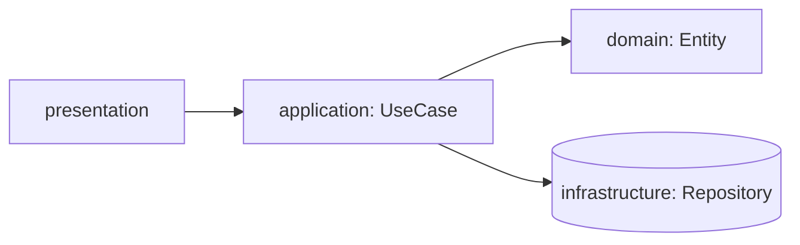
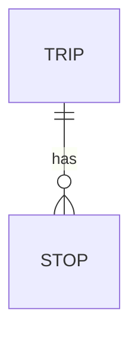

# Plan: <Feature title>

Feature: ./feature.md
Issue: #<n>
Status: draft | approved


## Context

<What exists today that this feature touches. Links to modules.>


## Architecture

<Which layers change and how data flows. One small diagram.>



| Module                   | Layer           | New/Changed | Purpose        |
| ------------------------ | --------------- | ----------- | -------------- |
| <path>                   | domain          | new         | <one line>     |


## Data model

<Entities, fields, types, constraints, indexes, migrations.>




## Contracts

### <METHOD /path>  or  <UseCase name>

Request:

```json
{}
```

Response 200:

```json
{}
```

Errors:

| Code | When                           | Body `error.code`     |
| ---- | ------------------------------ | --------------------- |
| 400  | <condition>                    | <CODE>                |


## UI components

| Component        | Location          | Purpose                  |
| ---------------- | ----------------- | ------------------------ |
| <Name>           | <path>            | <one line, no props>     |


## Naming

| Concept          | Name in code          | Notes                    |
| ---------------- | --------------------- | ------------------------ |
| <concept>        | <Name>                | <why this name>          |

i18n key namespace: `<feature>.*`


## Performance budgets

| Metric                        | Budget        | How measured         |
| ----------------------------- | ------------- | -------------------- |
| <e.g. API p95 latency>        | <200 ms>      | <test or tool>       |


## Accessibility notes

<Components with non-trivial a11y: focus traps, live regions, custom
widgets and the ARIA pattern they follow.>


## Decisions

### D-1. <decision>

Chosen: <option>
Alternatives: <options>
Why: <reason>


## Risks

- <risk>: <mitigation>


## Left to implementation

<Details the owning task decides: values, styling, props, copy.
One line each, with the task ID.>

- <what>: <task>
