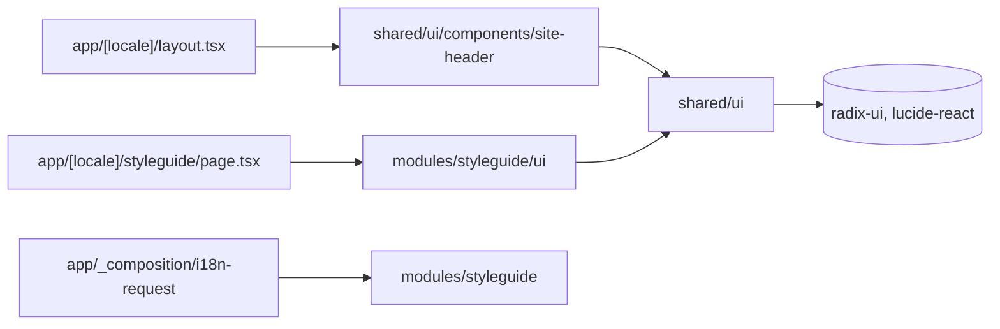
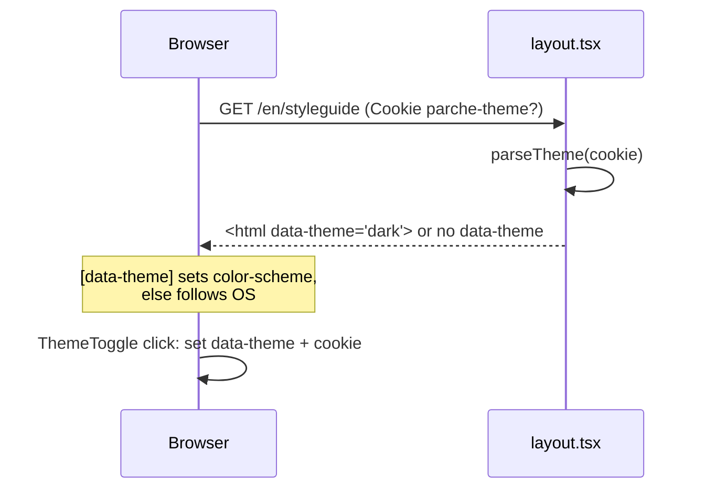

# Plan: Design system

Feature: ./feature.md
Issue: #1
Status: approved


## Context

Today the app is a scaffold:

- `src/app/[locale]/layout.tsx`: `<html lang>`, next-intl provider,
  imports `src/app/globals.css` (only `@import "tailwindcss"`).
- `src/app/[locale]/page.tsx`: home, `h1` = `common.appName`.
- `src/app/_composition/i18n-request.ts`: merges shared messages.
- `src/shared/i18n/messages/{en,es}.json`: `common.appName`,
  `common.tagline`.
- `biome.json`: recommended rules, no plugins.
- `playwright.config.ts`: projects `desktop` (Desktop Chrome) and
  `mobile` (Pixel 7, 412px wide). Every scenario runs in both.
- `tests/steps/common.steps.ts`: `I open the home page`, `my locale
  is`, `I see the heading`, `I see the text`, `the page has no
  accessibility violations`.
- No `src/shared/ui/`, no modules yet.

This feature adds no business module, no table and no API endpoint.
Code lives in `src/shared/ui` (tokens, primitives, root header) and
in a new UI-only module `src/modules/styleguide` (the `/styleguide`
screen, ADR 0008). `src/app` stays a router: route files and
`_composition/` only.


## Architecture



New and changed files, by layer:

| Path                                      | New/Chg | Purpose               |
| ----------------------------------------- | ------- | --------------------- |
| **shared/ui**                             |         |                       |
| `src/shared/ui/tokens.css`                | new     | tokens and variants   |
| `src/shared/ui/fonts.ts`                  | new     | next/font loaders     |
| `src/shared/ui/theme.ts`                  | new     | cookie name, `Theme`  |
| `src/shared/ui/cx.ts`                     | new     | join class names      |
| `src/shared/ui/translatable.ts`           | new     | text or message key   |
| `src/shared/ui/components/*.tsx`          | new     | primitives, header    |
| **module styleguide**                     |         |                       |
| `src/modules/styleguide/index.ts`         | new     | server API (messages) |
| `src/modules/styleguide/ui/**`            | new     | screen, sections      |
| `src/modules/styleguide/messages/**`      | new     | copy, one file each   |
| **app (router)**                          |         |                       |
| `src/app/[locale]/layout.tsx`             | chg     | fonts, theme, header  |
| `src/app/[locale]/styleguide/page.tsx`    | new     | route only            |
| `src/app/globals.css`                     | chg     | imports tokens, base  |
| `src/app/_composition/i18n-request.ts`    | chg     | merges module copy    |
| `src/app/_composition/i18n-types.d.ts`    | new     | typed message keys    |
| **tooling**                               |         |                       |
| `biome.json`, `biome-plugins/*.grit`      | new/chg | token + a11y lint     |
| `.dependency-cruiser.cjs`                 | chg     | `app-is-a-router`     |

Components in `src/shared/ui/components/`: `icon`, `wordmark`,
`text`, `stack`, `button`, `input`, `tooltip`, `card`, `dialog`,
`theme-toggle`, `site-header`.

Rules (on top of `docs/standards/architecture.md`):

- `src/shared/ui` imports only `src/shared/**`, `react`, `next/*`,
  `next-intl`, `radix-ui`, `lucide-react`.
- Components live in `src/shared/ui/components/`, one file each.
  Non-component files (`tokens.css`, `fonts.ts`, `theme.ts`,
  `cx.ts`, `translatable.ts`) stay in `src/shared/ui/`.
- No barrel file. Import each component from its own file:
  `import { Button } from "@/shared/ui/components/button"`.
- Primitives accept no `className` and no `style` prop. Features
  compose them; they do not restyle them.
- Primitives translate their own text (D-7). See "Translatable
  text".
- `src/app` holds only Next route files (`page`, `layout`,
  `loading`, `error`, `global-error`, `not-found`, `template`,
  `default`, `route`), `globals.css` and `_composition/`. No
  `_components`. Enforced by `app-is-a-router` (T03).
- `styleguide` module has only `ui/`, `messages/` and `index.ts`
  (no business rules). Public APIs: `@/modules/styleguide/ui`
  (`StyleguideScreen`) and `@/modules/styleguide`
  (`loadStyleguideMessages`, type `StyleguideMessages`;
  `import "server-only"`).
- `NextIntlClientProvider` in `layout.tsx` keeps passing all
  messages (next-intl v4 default), so client primitives can
  translate too.


## Data model

No database changes.

Client state: one cookie, `parche-theme`.

- Values: `light` or `dark`.
- Attributes: `Path=/; Max-Age=31536000; SameSite=Lax`, plus
  `Secure` when `location.protocol` is `https:`.
- Written by the client (`document.cookie`) in `ThemeToggle`, so
  not `HttpOnly`.
- Absent cookie or unknown value: theme follows the OS.
- Read on the server in `layout.tsx` via `cookies()`.


## Contracts

No HTTP endpoints. Contracts below are CSS, TypeScript and DOM.

### Theme resolution



- `:root { color-scheme: light dark; }`
- `[data-theme="light"] { color-scheme: light; }`
- `[data-theme="dark"] { color-scheme: dark; }`
- Every color token is `light-dark(<light hex>, <dark hex>)`, so it
  follows `color-scheme` with no JS (AC-6, EC-5). `data-theme` also
  works on any subtree (the Color section shows both themes side
  by side).
- No `data-theme` attribute is rendered when the cookie is absent.
- `layout.tsx` renders `<html lang={locale} dir="ltr">` (i18n
  standard; RTL is out of scope).

### `src/shared/ui/theme.ts`

```ts
export const THEME_COOKIE = "parche-theme";
export const THEME_COOKIE_MAX_AGE_SECONDS = 31_536_000;
export type Theme = "light" | "dark";
export function parseTheme(value: string | undefined): Theme | undefined;
export function oppositeTheme(theme: Theme): Theme;
```

### Tokens (`src/shared/ui/tokens.css`)

The only file allowed to hold raw values. Structure, in order:

1. `@theme { --*: initial; ... }` resets every Tailwind default,
   then defines the tokens below. Only token utilities exist
   afterwards (`p-13`, `bg-red-500`, `m-4` generate nothing).
2. `:root` / `[data-theme]` `color-scheme` rules (above).
3. `@custom-variant` definitions (below).
4. `@utility duration-fast`, `@utility duration-normal`,
   `@utility scrim-bottom` (below).
5. `@keyframes` for the `--animate-*` tokens.

Spec token → CSS variable (utility example):

- `color.bg` → `--color-bg` (`bg-bg`)
- `color.surface` → `--color-surface-1..3`, layered (`bg-surface-2`)
- `color.text` → `--color-text`, `--color-text-muted`
  (`text-text-muted`)
- `color.border` → `--color-border`, `--color-border-strong`
  (`border-border-strong`)
- `color.accent` → `--color-accent`, `--color-accent-hover`,
  `--color-on-accent` (`bg-accent`)
- `color.secondary` → `--color-secondary`, `--color-secondary-hover`,
  `--color-on-secondary` (`bg-secondary`) — second-tier emphasis:
  secondary buttons/badges/tags in a later feature, chart or
  highlight accents. No primitive uses it yet (feature.md "Out of
  scope"); the tokens ship ahead of that need.
- `color.focus` → `--color-focus` (`outline-focus`)
- `color.success|warning|error` → `--color-success` etc.
  (`text-error`)
- shadow color → `--color-shadow` (used by `--shadow-*`)
- dialog backdrop → `--color-overlay` (`bg-overlay`)
- photo-card scrim → `--color-scrim`, `--color-on-scrim` (`bg-scrim`,
  `text-on-scrim`) — flat values, not `light-dark()` (D-19); paired
  with the `scrim-bottom` utility (`background: linear-gradient(to
  top, var(--color-scrim) 0%, transparent 55%)`) for the future
  photo-hero-card (feature.md "Out of scope"; tokens ship now,
  component does not)
- `font.family.display|body` → `--font-display`, `--font-body`
  (`font-display`)
- `font.weight.regular|semibold|bold` → `--font-weight-*`
  (`font-semibold`)
- `font.size.xs..3xl` → `--text-xs..3xl` (`text-2xl`)
- `font.lineHeight.*` → `--leading-tight|normal|relaxed`
  (`leading-tight`)
- `space.0..8,10,12,16` → `--spacing-0..8,10,12,16` (`p-4`)
- touch target → `--spacing-touch` (`min-h-touch`)
- icon sizes → `--spacing-icon-sm|md|lg` (`size-icon-md`)
- bottom sheet max height → `--spacing-sheet` (`max-h-sheet`)
- `radius.sm|md|lg|full` → `--radius-*` (`rounded-md`)
- `shadow.sm|md` → `--shadow-sm|md` (`shadow-sm`)
- `motion.duration.fast|normal` → `--motion-duration-*`
  (`duration-fast`)
- `motion.easing.out` → `--ease-out` and `--motion-easing-out`
  (`ease-out`)
- animations → `--animate-fade-in|shake|sheet-up|dialog-in|spin`
  (`animate-shake`)
- widths → `--container-prose|nav|dialog|page|card`
  (`max-w-card`)
- breakpoints → `--breakpoint-sm|md|lg` (`md:flex`)

Values:

- Space: `n × 0.25rem` (space.1 = 0.25rem … space.8 = 2rem,
  space.10 = 2.5rem, space.12 = 3rem, space.16 = 4rem),
  `--spacing-0: 0`, `--spacing-touch: 2.75rem`,
  `--spacing-icon-sm: 1rem`, `--spacing-icon-md: 1.25rem`,
  `--spacing-icon-lg: 1.5rem`, `--spacing-sheet: 85dvh`.
- Font size (rem): xs 0.75, sm 0.875, md 1, lg 1.125, xl 1.375,
  2xl 1.75, 3xl 2.25.
- Font weight: regular 400, semibold 600, bold 700.
- Line height: tight 1.15, normal 1.5, relaxed 1.7.
- Radius: sm 0.5rem, md 1rem, lg 1.5rem, full 9999px.
- Shadows (light only; `--color-shadow` is transparent in dark):
  - `--shadow-sm: 0 1px 2px var(--color-shadow),
    0 1px 1px var(--color-shadow)`
  - `--shadow-md: 0 4px 12px var(--color-shadow),
    0 1px 3px var(--color-shadow)`
- Durations: fast 150ms, normal 250ms. `--ease-out`:
  `cubic-bezier(0.22, 1, 0.36, 1)`.
- Widths: prose 70ch, nav 14rem, dialog 32rem, page 72rem,
  card 18rem.
- Breakpoints: sm 40rem, md 48rem, lg 64rem.
- Defaults: `--default-transition-duration:
  var(--motion-duration-fast)`, `--default-transition-timing-function:
  var(--ease-out)`, `--default-font-family: var(--font-body)`.
- Fonts: `--font-display: var(--font-fredoka)`, `--font-body:
  var(--font-plus-jakarta-sans)` (variables set by `fonts.ts`; they
  include the fallback stacks).

Animations (each keyframe named like its token):

- `fade-in`: opacity 0 → 1, `duration-fast`, ease-out.
- `shake`: translateX 0 → −space.1 → +space.1 → 0, three cycles,
  `duration-normal`.
- `sheet-up`: translateY(100%) → 0, `duration-normal`.
- `dialog-in`: scale(0.96) → 1 plus opacity 0 → 1,
  `duration-normal`.
- `spin`: rotate 0 → 360deg, 1s linear infinite.

Colors (hex; the contrast unit test parses them), light / dark.
Round 2 (`docs/styleguide.md`) replaces the whole neutral/accent
palette with a vibrant travel-journal direction and adds a second
accent (`secondary`) and the photo-card `scrim`; `success`,
`warning`, `error` are unchanged (already re-verified against the
new neutrals):

| Token             | Light       | Dark          |
| ------------------ | ----------- | ------------- |
| `bg`               | `#FAFAFA`   | `#16161D`     |
| `surface-1`        | `#FFFFFF`   | `#1E1E27`     |
| `surface-2`        | `#F5F5F7`   | `#262631`     |
| `surface-3`        | `#F5F4FA`   | `#302F3D`     |
| `text`             | `#18181B`   | `#F4F4F6`     |
| `text-muted`       | `#63636D`   | `#A8A6B3`     |
| `border`           | `#E4E4E7`   | `#38384A`     |
| `border-strong`    | `#8A8894`   | `#6E6C7D`     |
| `accent`           | `#C83812`   | `#FF9666`     |
| `accent-hover`     | `#A82E0D`   | `#FFB877`     |
| `on-accent`        | `#FFFFFF`   | `#16161D`     |
| `secondary`        | `#0E7A6B`   | `#57E0C7`     |
| `secondary-hover`  | `#084A41`   | `#8CEBDA`     |
| `on-secondary`     | `#FFFFFF`   | `#16161D`     |
| `focus`            | `var(--color-accent)` (both themes)        |
| `success`          | `#1F7A3A`   | `#5FD08A`     |
| `warning`          | `#8A5A00`   | `#F2C14E`     |
| `error`            | `#B42318`   | `#FF8A80`     |
| `shadow`           | `#18181B14` | `transparent` |
| `overlay`          | `#18181B99` | `#000000B3`   |
| `scrim`            | `#000000A6` (flat, both themes — D-19)     |
| `on-scrim`         | `#FFFFFF` (flat, both themes — D-19)       |

All pairs below were checked at plan time (`docs/styleguide.md` has
the per-pair ratios) and pass with margin.

Required contrast pairs (checked by `tokens.test.ts`, both themes):

| Foreground                 | Background                     | Min   |
| --------------------------- | ------------------------------- | ----- |
| `text`                      | `bg`, `surface-1..3`            | 4.5   |
| `text-muted`                | `bg`, `surface-1..3`            | 4.5   |
| `accent`                    | `bg`, `surface-1..3`            | 4.5   |
| `on-accent`                 | `accent`, `accent-hover`        | 4.5   |
| `secondary`                 | `bg`, `surface-1..3`            | 4.5   |
| `on-secondary`              | `secondary`, `secondary-hover`  | 4.5   |
| `success/warning/error`     | `bg`, `surface-1`               | 4.5   |
| `border-strong`             | `bg`, `surface-1`               | 3     |

`focus` equals `accent`, so it passes 3:1 wherever `accent` passes
4.5:1 (AC-19 asks for the accent color). `scrim`/`on-scrim` are not
in this table: they mask an arbitrary destination photo, not an app
surface, so their guarantee is derived by hand (`docs/styleguide.md`
"Scrim"), not checked against `bg`/`surface-*`.

### Custom variants (in `tokens.css`)

```css
@custom-variant dark {
  &:where([data-theme="dark"], [data-theme="dark"] *) { @slot; }
  @media (prefers-color-scheme: dark) {
    &:where(:root:not([data-theme]), :root:not([data-theme]) *) {
      @slot;
    }
  }
}
@custom-variant ui-hover {
  &:hover { @slot; }
  &:where([data-preview="hover"] *) { @slot; }
}
@custom-variant ui-focus {
  &:focus-visible { @slot; }
  &:where([data-preview="focus"] *) { @slot; }
}
@custom-variant ui-active {
  &:active { @slot; }
  &:where([data-preview="active"] *) { @slot; }
}
```

- Primitives style hover/focus/active only through `ui-hover:`,
  `ui-focus:`, `ui-active:`. Never plain `hover:`/`focus-visible:`.
- The styleguide wraps a sample in `data-preview="hover"` (etc.) to
  show that state statically (AC-10).

### Shared primitive rules

- Root element carries `data-ui="<name>"` (`button`, `input`,
  `card`, `card-button`, `card-link`, `stack`, `text`, `icon`,
  `dialog`, `tooltip`, `wordmark`, `theme-toggle`). Tests use it
  when no role fits.
- Interactive primitives: `min-h-touch min-w-touch` (AC-21),
  `transition duration-fast ease-out` (AC-9), focus ring
  `ui-focus:outline-2 ui-focus:outline-solid ui-focus:outline-focus
  ui-focus:outline-offset-2` with the element's own radius (AC-19).
- Movement (translate, scale, shake, slide, spin) only under
  `motion-safe:`. Opacity fades are unconditional (AC-8).
- Disabled: `disabled:opacity-50 disabled:cursor-not-allowed`, no
  hover change.

### Translatable text (`src/shared/ui/translatable.ts`, T01)

```ts
// Any full dot-path key of the app messages
// ("styleguide.button.sample"). Typed through next-intl's AppConfig
// (src/app/_composition/i18n-types.d.ts), so a typo is a type
// error. Derive it from next-intl's types for useTranslations()
// with no namespace; do not hand-write a union.
export type MessageKey = /* derived from next-intl */;

// String props: literal text or a message key (+ ICU values).
export type Translatable =
  | string
  | { translateId: MessageKey; values?: TranslationValues };

// Content of single-text primitives (Text, Button):
// children XOR key.
export type TextContent =
  | { children: ReactNode; translateId?: never; values?: never }
  | {
      translateId: MessageKey;
      values?: TranslationValues;
      children?: never;
    };

// Returns a resolver: string → as is;
// { translateId } → t(translateId, values).
// Uses useTranslations() (no namespace). Works in server and client
// components (sync components only; next-intl rule).
export function useTranslatable(): (text: Translatable) => string;
```

Rules:

- A plain string is rendered as is: use it for proper nouns, user
  data and text already translated by the caller. Every other UI
  text uses `translateId`.
- Rich text (`t.rich`) is out of scope; compose `Text` elements
  instead.
- `i18n-types.d.ts`: `declare module "next-intl" { interface
  AppConfig { Locale: Locale; Messages: SharedMessages & {
  styleguide: StyleguideMessages } } }` with types from the en
  JSON files. T01 creates it with shared messages; T02 adds
  `styleguide`.
- Component unit tests render through `tests/setup/intl.tsx`
  (`renderWithIntl(ui, { messages })`, wraps
  `NextIntlClientProvider` with locale `en`).

Examples:

```tsx
<Text as="h2" size="xl" translateId="styleguide.brand.title" />
<Text tone="muted">Bogotá → Cartagena</Text>
<Button translateId="styleguide.button.sample" />
<Input
  label={{ translateId: "styleguide.input.label" }}
  error={{ translateId: "styleguide.input.error" }}
/>
<Tooltip content={{ translateId: "styleguide.tooltip.content" }}>
  …
</Tooltip>
<Card heading={activity.name} /> // user data: plain string
```

### Primitive APIs

```ts
// components/icon.tsx (T01)
type IconProps = {
  icon: LucideIcon;
  size?: "sm" | "md" | "lg"; // default "md" → size-icon-md
  // set: role="img" + aria-label; unset: aria-hidden
  label?: Translatable;
};

// components/wordmark.tsx (T01)
// "parche" (brand name, plain string), font-display, text-accent,
// dashed "stitched" border, rounded-full.
export function Wordmark(): JSX.Element;

// components/text.tsx (T04)
type TextProps = TextContent & {
  as?: "p" | "span" | "h1" | "h2" | "h3" | "h4" | "strong" | "code";
  size?: "xs" | "sm" | "md" | "lg" | "xl" | "2xl" | "3xl"; // "md"
  font?: "display" | "body"; // default "body"
  weight?: "regular" | "semibold" | "bold"; // default "regular"
  leading?: "tight" | "normal" | "relaxed";
  tone?: "default" | "muted" | "accent" | "success" | "warning"
    | "error";
  id?: string;
  tabIndex?: -1;
};

// components/stack.tsx (T04)
type Space =
  | "0" | "1" | "2" | "3" | "4" | "5" | "6" | "7" | "8"
  | "10" | "12" | "16";
type StackProps = {
  as?: "div" | "ul" | "ol" | "section" | "article";
  direction?: "vertical" | "horizontal"; // default "vertical"
  gap?: Space; // default "4"
  align?: "start" | "center" | "end" | "stretch";
  justify?: "start" | "center" | "end" | "between";
  wrap?: boolean; // flex-wrap
  children: ReactNode;
};

// components/button.tsx (T06)
type NativeButton = Omit<
  ComponentPropsWithRef<"button">,
  "className" | "style" | "children"
>;
type ButtonProps = NativeButton & TextContent & {
  variant?: "primary" | "secondary"; // default "primary"
  type?: "button" | "submit" | "reset"; // default "button"
  icon?: LucideIcon; // decorative, before the label
  // Label rendered sr-only; still the accessible name.
  // Requires `icon` (type-level: icon is required when true).
  labelHidden?: boolean;
  isLoading?: boolean;
};
// isLoading: spinner (LoaderCircle, motion-safe:animate-spin,
// opacity pulse otherwise) replaces the icon slot, label stays,
// aria-busy="true", aria-disabled="true", onClick ignored, stays
// focusable.
// labelHidden: square button (min-w-touch min-h-touch), same
// states, focus ring and touch target as any Button.

// components/input.tsx (T07)
type NativeInput = Omit<
  ComponentPropsWithRef<"input">,
  "className" | "style" | "aria-invalid"
>;
type InputProps = NativeInput & {
  label: Translatable; // visible <label>
  hint?: Translatable;
  error?: Translatable; // aria-invalid, text-error, CircleAlert
};
// ids via useId. aria-describedby = hint id + error id.
// Error container always rendered with aria-live="polite".
// Error text enters with animate-fade-in + motion-safe:animate-shake.

// components/tooltip.tsx (T08)
type TooltipProps = {
  content: Translatable; // text only, no elements
  children: ReactElement; // trigger (Radix Trigger asChild)
  open?: boolean; // controlled (Card uses it)
  onOpenChange?: (open: boolean) => void;
};
// Radix Tooltip.Provider inside. Hoverable content on. Escape
// closes. delayDuration = TOOLTIP_DELAY_MS (D-15).

// components/card.tsx (T09)
type CardProps = { heading: Translatable; children?: ReactNode };
type CardButtonProps = {
  heading: Translatable;
  onClick: () => void;
  children?: ReactNode;
};
type CardLinkProps = {
  heading: Translatable;
  href: string;
  children?: ReactNode;
};
// Card: <article>, heading wraps.
// CardButton: <button type="button">. CardLink: next-intl Link.
// Clickable heading: truncate (one line, ellipsis) + data-truncate.
// When the heading overflows (ResizeObserver, scrollWidth >
// clientWidth) the trigger is wrapped in Tooltip with content =
// resolved heading. When it does not overflow, no tooltip opens and
// no aria-describedby is set.

// components/dialog.tsx (T10)
type DialogProps = {
  trigger: ReactElement; // usually a Button (Radix Trigger asChild)
  title: Translatable;
  description?: Translatable;
  closeLabel: Translatable; // name of the X Button (labelHidden)
  footer?: ReactNode; // buttons; wrap in DialogClose to close
  children?: ReactNode;
  open?: boolean;
  onOpenChange?: (open: boolean) => void;
};
// DialogClose(p: { children: ReactElement }): Radix Close asChild.
// < md: bottom sheet (inset-x-0 bottom-0, rounded top,
// max-h-sheet, motion-safe:animate-sheet-up, fade always).
// >= md: centered, max-w-dialog, motion-safe:animate-dialog-in.
// Overlay bg-overlay. Radix gives focus trap, Escape, scroll lock,
// focus return. Close X = <Button variant="secondary" icon={X}
// labelHidden>.

// components/theme-toggle.tsx (T05)
type ThemeToggleProps = {
  toDarkLabel: Translatable;
  toLightLabel: Translatable;
};
// Built on Button (secondary, labelHidden) styles: one <button
// data-ui="theme-toggle"> containing Moon icon + sr-only
// toDarkLabel shown in light theme (`dark:hidden`), and Sun icon +
// sr-only toLightLabel shown in dark theme (`hidden dark:inline`).
// The right name needs no JS. Click: effective theme =
// html.dataset.theme ?? (matchMedia dark ? "dark" : "light");
// set html.dataset.theme = opposite; write cookie. Cookie write
// failure is silent. ThemeToggle renders its own <button> (Button
// takes one label) but reuses Button's class map from button.tsx
// (exported as buttonClasses).

// components/site-header.tsx (T01, toggle added in T05)
// <header>: next-intl Link to "/" wrapping <Wordmark />, then
// <ThemeToggle toDarkLabel={{ translateId:
// "header.themeToggle.toDark" }} … />. No props.
```

### Styleguide DOM contract

- Route: `/[locale]/styleguide`. `<main>` holds the content.
- `h1`: `styleguide.page.title`.
- Section nav: `<nav aria-label={styleguide.page.navLabel}>` with a
  `<ul>` of `<a href="#<id>">`. Active link:
  `aria-current="location"`, `text-accent underline`.
- Section ids and order (`STYLEGUIDE_SECTIONS` in
  `ui/sections/sections.ts`): `brand`, `color`, `type`, `spacing`,
  `radius-shadow`, `motion`, `icons`, `primitives`.
- Each section: `<section id aria-labelledby="<id>-heading">` with
  `<h2 id="<id>-heading" tabIndex={-1}>`.
- Each primitive demo in Primitives: `<section aria-labelledby>` +
  `h3` with the primitive name (region role).
- State samples: `<figure>` per state with `<figcaption>` = state
  name (`styleguide.<demo>.states.<state>`), wrapper
  `data-preview="hover|focus|active"` for forced states.
- Sample targeting: when a step names a primitive inside a demo
  ("the "Save trip" button in the "Button" demo"), it targets the
  sample whose figcaption is "Default", unless the step names a
  state ("the loading …", "… in the error state"). Samples outside
  a state figure (the "Cancel" button, the "Café" card, the static
  card) have unique names.
- Token names shown as text (`color.bg`, `space.4`) are code
  identifiers, not translated. No raw values are printed.
- Tailwind classes must be literal strings (no `bg-${name}`), so
  swatch and sample components use literal maps.

### Demo content (tests depend on these en strings)

All strings live in `messages/<locale>/<demo>.json` of the module.
es strings are free to choose except where listed, and stay within
+40% of en.

- **Stack and Text** (`layout`): one `Text` per size xs..3xl, each
  labeled with its token name (`font.size.md`), inside a vertical
  `Stack`; one state figure "Default".
- **Button**: figures Default, Hover, Focus, Active, Loading,
  Disabled; each button label "Save trip" (es "Guardar el viaje").
  Outside the figures: one secondary "Cancel" button.
- **Input**: figures Default, Hover, Focus, Disabled, Error; label
  "City" (es "Ciudad"); hint "Where the trip starts"; error "Enter a
  city name" (es "Escribe el nombre de una ciudad").
- **Tooltip**: a secondary Button "Add to budget" with tooltip "Adds
  this activity to the trip budget".
- **Card**: a static `Card` "Museo del Oro and the Candelaria
  walking tour with lunch" (wraps); `CardButton` figures Default,
  Hover, Focus, Active with the same heading (truncates, tooltip);
  a `CardButton` "Café" (short, no tooltip). Every card is capped
  at `max-w-card` (18rem) so the long name overflows at any
  viewport.
- **Dialog**: trigger Button "Rename trip"; title "Rename trip";
  description "Friends see the new name right away."; body `Input`
  "Trip name"; footer `DialogClose` secondary "Cancel" + primary
  "Save"; closeLabel "Close".

State-figure layout (AC-22, round 2): the Button, Input, Tooltip,
Card and Dialog demos wrap their figures in
`<Stack direction="horizontal" wrap gap="4">` instead of the default
vertical `Stack`, so figures sit in a row that wraps as the viewport
narrows, using the desktop width instead of a single cramped column.
Tooltip and Dialog keep this wrapper even though they render only
one figure today, so a later figure needs no layout change. Stack
and Text (`layout-demo.tsx`) is the one exception and keeps the
default vertical `Stack` — the point is demonstrating a real line
length. `button-demo.tsx` (T06, merged) still uses a vertical
`Stack`; T14 changes it to the row layout (it already owns this
file).

### Messages

Namespaces and files:

| Namespace           | File                                         |
| ------------------- | -------------------------------------------- |
| `common`, `header`  | `src/shared/i18n/messages/{en,es}.json`      |
| `styleguide.<name>` | `src/modules/styleguide/messages/<l>/<name>.json` |

`<name>` ∈ `page, brand, color, type, spacing, radiusShadow, motion,
icons, primitives, layout, button, input, card, tooltip, dialog`.
`messages/load.ts` exports `loadStyleguideMessages(locale)` which
imports all of them and returns `{ page: …, brand: …, … }`; the
module `index.ts` re-exports it. `i18n-request.ts` returns
`{ ...shared, styleguide: await loadStyleguideMessages(locale) }`.

Key copy, en / es:

- `common.appName`: Parche / Parche
- `header.themeToggle.toDark`: Switch to dark theme / Cambiar a
  tema oscuro
- `header.themeToggle.toLight`: Switch to light theme / Cambiar a
  tema claro
- `styleguide.page.title`: Parche design system / Sistema de diseño
  de Parche
- `styleguide.page.navLabel`: Styleguide sections / Secciones de la
  guía
- `styleguide.<section>.title`: Brand, Color, Type, Spacing, Radius
  and shadow, Motion, Icons, Primitives / Marca, Color, Tipografía,
  Espaciado, Radio y sombra, Movimiento, Íconos, Componentes
- `styleguide.button.sample`: Save trip / Guardar el viaje
- `styleguide.<demo>.states.*`: Default, Hover, Focus, Active,
  Disabled, Loading, Error / Normal, Encima, Foco, Presionado,
  Deshabilitado, Cargando, Error

The header home link has no extra key: its name is the wordmark
text "parche".

### Lint rules (`biome.json` + `biome-plugins/`)

Spike on Biome 2.5.14 confirmed: GritQL plugins run on CSS and
JS/TSX, `$filename` scoping works, capture groups in `r"..."` break
the plugin (use `(?:...)`), and a plugin that fails at runtime only
emits an **info**, never an error. The fixture scenarios are the
guard.

- `biome-plugins/raw-css-values.grit` (css): `CssDeclaration()`
  whose value has a hex color, `rgb(`/`rgba(`/`hsl(`/`hsla(`/
  `oklch(`, a number + `px|rem|em|ms|s`, or a named color.
  Message: `Raw design value. Use a token from
  src/shared/ui/tokens.css.`
- `biome-plugins/raw-js-values.grit` (js):
  `JsStringLiteralExpression()`, `JsxString()`,
  `JsTemplateChunkElement()` with the same matches, or a string
  equal to a named color. Same message.
- `biome-plugins/tailwind-arbitrary.grit` (js): the same string
  nodes containing `[a-z0-9]-\[[^\]]+\](?:[^:]|$)` (arbitrary
  value; `data-[state=open]:` variants allowed). Message:
  `Tailwind arbitrary value. Use a token utility.`
- `biome-plugins/no-inline-style.grit` (js): `JsxAttribute()` named
  `style`. Message: `Inline style. Use token utilities instead.`

Every plugin starts with:

```
$filename <: r".*/src/.*",
$filename <: not r".*/src/shared/ui/tokens\.css",
$filename <: not r".*\.test\.tsx?",
```

Named colors: the full CSS named-color list (148 names), matched
only in the value part (`:[^;]*\b(?:red|...)\b`, so `white-space`
is not a hit). `transparent`, `currentColor`, `inherit` are allowed.

`biome.json` also sets, under `linter.rules.a11y`:
`noStaticElementInteractions`, `noNoninteractiveElementInteractions`,
`useKeyWithClickEvents` = `"error"` (AC-2).

Router guard (`.dependency-cruiser.cjs`, runs in `pnpm lint:deps`):

```js
{
  name: "app-is-a-router",
  comment:
    "src/app holds route files and _composition only. " +
    "UI lives in modules or shared/ui.",
  severity: "error",
  from: { path: "^src/app/" },
  to: {
    path: "^src/app/.+\\.tsx$",
    pathNot:
      "/(page|layout|loading|error|global-error|not-found" +
      "|template|default)\\.tsx$",
  },
}
```

A stray component in `src/app` only matters once something imports
it, so forbidding the import is enough.


## Test harness

- Lint scenarios (`tests/steps/lint.steps.ts`): write the snippet to
  `<os tmpdir>/<random>/<given path>` (the path contains `/src/`),
  run `node_modules/.bin/biome lint --config-path=<repo root>
  --vcs-enabled=false <file>` with `cwd` = the temp dir, read
  stdout+stderr, assert the message substring, or "No fixes
  applied" + exit 0. Delete the temp dir after. Plugin paths in
  `biome.json` are relative to the config file (verified).
- Router guard (`tests/steps/deps.steps.ts`): temp dir with
  `src/app/page.tsx` importing `./<file>` and a minimal
  `tsconfig.json`; run `node_modules/.bin/depcruise src --config
  <repo>/.dependency-cruiser.cjs` with `cwd` = temp dir (add
  `--ts-config` if resolution needs it); assert the rule name.
- The `mobile` project (Pixel 7) is touch. Scenarios that need a
  mouse hover are tagged `@desktop`; the mobile project sets
  `grepInvert: /@desktop/` (T01).
- Scenarios that depend on width set the viewport explicitly.
- "Zoom 200%" = 640×400 CSS px viewport (Playwright cannot
  page-zoom). "Text size 200%" = `html { font-size: 200% }`
  injected before load.


## UI components

| Component           | Location (from `src/`)              | Kind    |
| ------------------- | ----------------------------------- | ------- |
| `SiteHeader`        | `shared/ui/components/site-header`  | server  |
| `StyleguidePage`    | `app/[locale]/styleguide/page`      | route   |
| `StyleguideScreen`  | `…/ui/styleguide-screen`            | server  |
| `SectionNav`        | `…/ui/components/section-nav`       | client  |
| `StyleguideSection` | `…/ui/components/styleguide-section` | server |
| `StateSample`       | `…/ui/components/state-sample`      | server  |
| `<Name>Section`     | `…/ui/sections/<name>-section`      | server  |
| `<Name>Demo`        | `…/ui/demos/<name>-demo`            | server  |

`…` = `modules/styleguide`.

- `StyleguidePage`: `generateMetadata`, `setRequestLocale`, renders
  `<StyleguideScreen />`. No markup.
- `StyleguideScreen`: `<main>`, `h1`, `SectionNav`, sections.
- `SectionNav`: props `label`, `links: { id, label }[]`; state:
  active id.
- `StyleguideSection`: props `id`, `title`, `children`.
- `StateSample`: props `label`, `preview?`, `children` (a figure).

Page layout: `max-w-page mx-auto px-4`. Desktop (`md:`): `flex`,
nav `w-nav shrink-0 sticky top-0 self-start`, content `flex-1
min-w-0`. Mobile: nav `ul` is `flex flex-wrap gap-x-4 gap-y-2`
above content. Never `overflow-x-auto` on the nav.

SectionNav behavior (T11):

- Click: `preventDefault`; `heading.scrollIntoView({ behavior:
  reducedMotion ? "auto" : "smooth", block: "start" })`;
  `heading.focus({ preventScroll: true })`; set active id;
  `history.replaceState(null, "", "#" + id)`.
- Scroll spy: one `IntersectionObserver` on the 8 sections,
  `rootMargin: "0% 0% -60% 0%"` (percent only: strings with `px`
  fail lint). Active = the top-most intersecting section. Clicks
  set active immediately.
- Reduced motion read via `matchMedia("(prefers-reduced-motion:
  reduce)")` at click time.

### Component usage guide (round 2)

Not new tokens — makes explicit the radius/border/shadow logic
already implicit across T06/T09/T10, so later features follow one
rule instead of re-deriving it. Full rationale and the confirmed
`radius-md` → Input assignment: `docs/styleguide.md` "Component
usage guide".

- **Card vs Dialog, not "modal vs drawer"**: `Dialog` already
  responsively becomes a bottom sheet below `md`, so there is no
  separate Drawer primitive. The real choice is blocking: `Card` is
  inline, non-blocking, browsable; `Dialog` blocks the page (focus
  trap, overlay, scroll lock) for one task. A `CardButton` opening a
  `Dialog` is the expected chain, not a reason for a third primitive.
- **Radius scales by role**: `radius-sm` — small, floating,
  transient (Tooltip). `radius-md` — mid-size resting control
  (Input, T07). `radius-lg` — larger resting container (Card,
  Dialog). `radius-full` — reserved for the one tappable-action
  shape (Button only); never reused for a passive container.
- **Border is solid only**; no dashed/dotted anywhere — weight, not
  style, carries meaning. `border-border` (subtle): passive resting
  surfaces (Card, Dialog content in dark mode). `border-border-strong`
  (≥ 3:1): controls that read as operable (Input, Button secondary).
- **Shadow is light-theme only** (`--color-shadow` resolves to
  `transparent` in dark; border is dark mode's only depth cue).
  `shadow-sm` — resting surfaces (Card). `shadow-md` — floating/
  overlay surfaces (Tooltip, Dialog). No third tier.

### Space usage guide (round 2)

How to pick among the existing `space.*`/`container-*` values — no
new values. Full detail: `docs/styleguide.md` "Space usage guide".

- Every margin/padding/gap comes from the `space.*` scale; never
  round to an arbitrary pixel.
- Three spacing jobs, three ranges: **inside** a component
  (`space.2`–`space.6`), **between related things** — a `Stack`
  `gap` (`space.1`–`space.4`), **between unrelated things** — page/
  section rhythm (`space.8`–`space.16`).
- Density is a `Stack` `gap` choice (e.g. `gap="2"` tight list vs.
  `gap="4"` card grid), never a denser/looser component variant.
- Pick a `container-*` by content type, not by screen:
  `container-prose` (paragraph text), `container-card` (a Card's
  width in a grid), `container-nav` (side nav), `container-dialog`
  (Dialog content), `container-page` (outer page shell). Nest
  narrower containers inside a `container-page` shell; never shrink
  a whole page to `container-prose`.
- Mobile-first: build the tight end of each range at the smallest
  breakpoint; widening at `sm`/`md`/`lg` moves up within the same
  range (or changes stack → row), never stacks extra margin on top
  of the mobile value.
- Vertical rhythm, consistent across every view: `gap="8"`–`gap="12"`
  between sections; `gap="2"`–`gap="4"` between a section heading and
  its body.


## Naming

| Concept               | Name in code                  | Where           |
| --------------------- | ----------------------------- | --------------- |
| Theme value           | `Theme` (`light` \| `dark`)   | `theme.ts`      |
| Theme cookie          | `THEME_COOKIE`                | `parche-theme`  |
| Cookie lifetime       | `THEME_COOKIE_MAX_AGE_SECONDS` | `theme.ts`     |
| Parse cookie          | `parseTheme`                  | `theme.ts`      |
| Flip theme            | `oppositeTheme`               | `theme.ts`      |
| Theme attribute       | `data-theme` on `<html>`      | absent = OS     |
| Theme variant         | `dark:`                       | `tokens.css`    |
| State variants        | `ui-hover:` `ui-focus:` `ui-active:` | tokens.css |
| State preview attr    | `data-preview`                | styleguide only |
| Primitive marker      | `data-ui`                     | tests           |
| Truncation marker     | `data-truncate`               | reflow checks   |
| Class join            | `cx(...parts)`                | `cx.ts`         |
| Text or message key   | `Translatable`                | `translatable.ts` |
| Content XOR key       | `TextContent`                 | `translatable.ts` |
| Message key prop      | `translateId`                 | full dot path   |
| ICU values prop       | `values`                      | next-intl       |
| Resolver hook         | `useTranslatable`             | `translatable.ts` |
| Typed key             | `MessageKey`                  | `translatable.ts` |
| Test render helper    | `renderWithIntl`              | `tests/setup/`  |
| Font loaders          | `fredoka`, `plusJakartaSans`  | `fonts.ts`      |
| Button classes        | `buttonClasses`               | `button.tsx`    |
| Root header           | `SiteHeader`                  | `components/`   |
| Tooltip delay         | `TOOLTIP_DELAY_MS` = 300      | `tooltip.tsx`   |
| Module                | `styleguide`                  | `src/modules/`  |
| Screen                | `StyleguideScreen`            | module `ui`     |
| Section ids           | `STYLEGUIDE_SECTIONS`         | `sections.ts`   |
| Message loader        | `loadStyleguideMessages`      | module index    |
| Messages type         | `StyleguideMessages`          | module index    |
| Router guard rule     | `app-is-a-router`             | dep-cruiser     |
| Route                 | `/[locale]/styleguide`        | app             |
| Scrim utility         | `scrim-bottom`                | `tokens.css`    |

Primitives (`src/shared/ui/components/`): `Icon`, `Wordmark`,
`Text`, `Stack`, `Button`, `Input`, `Tooltip`, `Card`, `CardButton`,
`CardLink`, `Dialog`, `DialogClose`, `ThemeToggle`.

Screen parts (module `ui/components/`): `SectionNav`,
`StyleguideSection`, `StateSample`.

i18n key namespaces: `header.*`, `styleguide.*` (and
`common.appName` changes).


## Performance budgets

| Metric                        | Budget   | How measured               |
| ----------------------------- | -------- | -------------------------- |
| LCP `/en`, `/en/styleguide`   | ≤ 2.5 s  | Lighthouse CI (T14)        |
| CLS `/en`, `/en/styleguide`   | ≤ 0.1    | Lighthouse CI              |
| CLS when webfonts arrive late | ≤ 0.01   | `@perf` scenario (T01)     |
| TBT (INP proxy)               | ≤ 200 ms | Lighthouse CI              |
| JS per route (gzip), `/en`    | ≤ 170 KB | Lighthouse CI              |
| JS, `/en/styleguide` (gzip)   | ≤ 200 KB | Lighthouse CI              |

- Theme toggle: no React re-render; DOM attribute + cookie only
  (code review, T05).
- Webfonts: 2 families, `latin` subset, variable weight
  (`fonts.ts` review).
- Lucide: named imports only (`import { Sun } from "lucide-react"`).
- Radix: import from `radix-ui` (`import { Dialog } from
  "radix-ui"`).
- `/en/styleguide` gets its own, higher JS budget
  (`lighthouserc.json`'s `assertMatrix`): it is a kitchen-sink
  reference page that mounts every primitive (Button, Input, Card,
  Dialog, Tooltip) at once, unlike any real screen a visitor lands
  on. Deferring those primitives' runtimes below the fold was tried
  and reverted — it made Card/Dialog/Tooltip's own controls
  unreachable by keyboard until scrolled into view, regressing
  AC-14/AC-19 for real users, not just this page's demos.


## Accessibility notes

- Dialog: WAI-ARIA Dialog (Modal) pattern via Radix Dialog. Title
  required; X Button named by `closeLabel`; focus trap, Escape,
  focus return and scroll lock come from Radix; do not
  re-implement.
- Tooltip: WAI-ARIA Tooltip pattern via Radix Tooltip; text-only
  content; hoverable; Escape dismisses (WCAG 1.4.13).
- Theme toggle: native `<button>`; its name comes from the sr-only
  span that CSS selects, so it is right before hydration.
- Icon-only buttons (`labelHidden`): the label stays in the DOM as
  sr-only text, so the accessible name is the translated label.
- Section headings are `tabIndex={-1}` so links can move focus.
- Input: visible label, `aria-invalid`, `aria-describedby` to hint
  and error; error region `aria-live="polite"`.
- Button loading: `aria-busy`, `aria-disabled`, stays focusable.
- Icons: `Icon` without `label` is `aria-hidden`; with `label` it is
  `role="img"` + `aria-label`. Semantic colors always paired with
  an icon or text.


## Decisions

### D-1. Theme via server-read cookie; every page renders dynamically

Chosen: `layout.tsx` reads `parche-theme` with `cookies()`.
Alternatives: inline pre-paint script (keeps static pages).
Why: spec asks the server to render the stored theme; later
features are dynamic anyway. Approved by the user. ADR 0007.

### D-2. `light-dark()` color tokens, not duplicated dark blocks

Chosen: every color token is `light-dark(light, dark)`;
`color-scheme` switches them.
Alternatives: `:root` + `[data-theme=dark]` + media-query blocks
with each token repeated.
Why: one definition per token; OS changes apply live with no JS
(AC-6, EC-5); subtree theming for the Color section. Baseline 2024.

### D-3. Reset the whole Tailwind theme (`--*: initial`)

Chosen: only our tokens produce utilities.
Alternatives: keep defaults and rely on lint only.
Why: a non-token class simply does not exist; lint covers raw
values and arbitrary values. Spike confirmed. Every namespace a
primitive uses (including font weights) must be defined.

### D-4. Token lint = Biome GritQL plugins + fixture scenarios

Chosen: four `.grit` plugins scoped by `$filename`.
Alternatives: custom Node script with regexes; Stylelint + ESLint.
Why: one tool (Biome) already in `pnpm lint`; AST-aware; spike
verified. Risk: a broken plugin only emits an info, so T03's
fixture scenarios must stay green.

### D-5. Inline `style` prop banned in `src/`

Chosen: `no-inline-style.grit`.
Alternatives: parse style objects for raw numbers.
Why: simpler and stricter; nothing in this feature needs it.

### D-6. Forced-state preview through custom variants

Chosen: `ui-hover`, `ui-focus`, `ui-active` variants that also match
inside `[data-preview=…]`.
Alternatives: styleguide-only `previewState` prop on primitives;
live-only demos.
Why: AC-10 needs each state visible side by side; primitives stay
free of styleguide props; axe checks contrast of every state (AC-5).

### D-7. Primitives translate their own text

Chosen: primitives call `useTranslatable()`; text comes as
`children` or `translateId` (single-text primitives) or as a
`Translatable` prop (`label`, `heading`, `title`, …).
Alternatives: callers translate and pass plain strings; paired
props (`label` / `labelId`).
Why: user request; one pattern everywhere; typed keys catch typos.
Cost: every page ships all messages to the client (see Risks).

### D-8. No barrel file in `shared/ui`

Why: parallel tasks never share an `index.ts`; better tree shaking.

### D-9. Dependencies: `radix-ui` and `lucide-react`

Chosen: unified `radix-ui` package; `lucide-react`. Both added in
T01 so the lockfile changes once. Approved by the user.

### D-10. Fonts via `next/font/google`

Chosen: self-hosted at build, `display: "swap"`, `adjustFontFallback`
(default true), `fallback` = `["ui-rounded", "system-ui",
"sans-serif"]` (Fredoka) and `["system-ui", "sans-serif"]` (Plus
Jakarta Sans), subset `latin` (covers á é í ó ú ñ ü ¿ ¡).
Why: no runtime request to Google; metric-matched fallback (EC-2).

### D-11. Disabled state exempt from contrast

Approved by the user; AC-5 amended in feature.md.

### D-12. App name becomes "Parche"

`common.appName` = "Parche" in both locales;
`tests/features/smoke.feature` expects heading "Parche" (edited in
this plan; red until T01). Approved by the user.

### D-13. Per-section message files

Why: 15 small files instead of one shared file lets styleguide tasks
run in parallel without touching the same file. ADR 0008 allows it.

### D-14. `styleguide` is a UI-only module; `app` is a router

Chosen: screen-specific UI in `src/modules/styleguide`; the root
header in `shared/ui/components`; no components in `src/app`,
enforced by dependency-cruiser.
Alternatives: `_components` / `_sections` private folders under
`src/app`.
Why: user request; one owner per screen; boundary rules apply;
messages sit where the i18n standard expects. ADR 0008.

### D-15. `TOOLTIP_DELAY_MS` is the one raw duration outside tokens

Chosen: `export const TOOLTIP_DELAY_MS = 300` in `tooltip.tsx`.
Alternatives: a `--motion-duration-tooltip` token read at runtime
with `getComputedStyle`.
Why: Radix needs a number at render; reading CSS at runtime adds
client work for no user benefit. Documented exception to the
"zero raw durations" metric; lint cannot see numeric literals.

### D-16. Icon-only buttons through `Button labelHidden`

Chosen: `Button` prop `labelHidden` (label sr-only, `icon`
required). Dialog X uses it; ThemeToggle reuses `buttonClasses`.
Alternatives: a new `IconButton` primitive (out of scope in
feature.md); ad-hoc `<button>`s in Dialog and ThemeToggle.
Why: one source for states, focus ring and touch target.

### D-17. `focus` color equals `accent`

Chosen: `--color-focus: var(--color-accent)`.
Why: AC-19 and the feature's accessibility section ask for the
accent color; keeping a `focus` token (AC-3) lets it change later
in one place.

### D-18. Two-accent color model: `accent` (primary) + `secondary`

Chosen: add `secondary`/`secondary-hover`/`on-secondary` alongside
`accent`, both contrast-checked the same way. `accent` stays the one
primary interactive color (main CTA fill, links, `focus`);
`secondary` is for second-tier emphasis (a later feature's secondary
buttons/badges/tags, highlight or chart accents) — nothing in this
feature uses it yet. Full color derivation (why `#C83812`/`#FF9666`
and not the image's flatter orange, two rejected rounds):
`docs/styleguide.md`. Approved by the user (refine round 2). ADR 0007.
Alternatives: keep a single accent and let a later feature invent
its own second color (rejected — repeats the problem this feature
exists to prevent); ship the full saturated image orange as `accent`
(rejected — fails 4.5:1 on light surfaces, see `docs/styleguide.md`).

### D-19. `scrim`/`on-scrim` are flat values, not `light-dark()`

Chosen: `--color-scrim: #000000A6`, `--color-on-scrim: #FFFFFF`, the
same in both themes — an exception to D-2.
Why: the scrim masks an arbitrary destination photo, not an app
surface; its job (guaranteeing 4.5:1 for white text over a
worst-case pure-white photo pixel) has nothing to do with the user's
light/dark preference. Ships with this feature; the photo-hero-card
component that uses it is out of scope (feature.md).


## Risks

- Biome plugin silently stops matching after an upgrade: T03
  fixture scenarios fail loudly; keep them in `@F1` regression runs.
- `light-dark()` unsupported in old browsers (pre-2024): colors fall
  back to nothing. Accepted; target is evergreen mobile browsers.
- Radix Tooltip ignores touch: tooltips are a hover/focus aid only;
  truncated Card text is still the accessible name of the Card.
- Dynamic rendering cost on Vercel: small; Lighthouse CI guards LCP.
- `next/font/google` downloads at build: CI needs network (already
  true for `pnpm install`).
- All messages go to the client on every page (D-7). Fine at this
  size (~10 KB); if it grows, pass only needed namespaces to
  `NextIntlClientProvider` in a later feature. Watch the JS budget
  in Lighthouse CI.
- A plain string prop bypasses i18n. Reviewer flags plain strings
  that are UI copy (not user data or proper nouns).
- Radix `data-state` styling needs `data-[state=open]:` variants;
  the arbitrary-value regex allows bracket variants followed by `:`.
