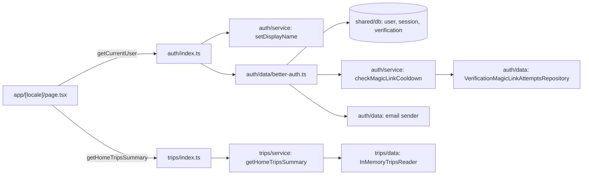
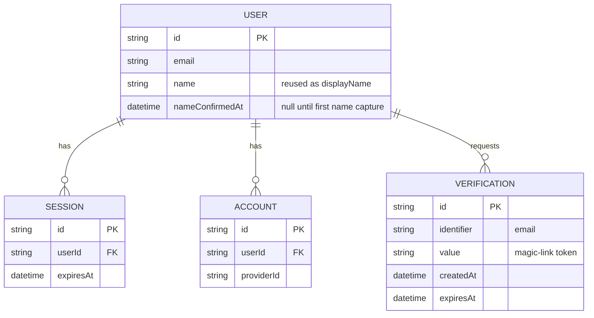

# Plan: Account creation, sign-in and home page

Feature: ./feature.md
Issue: #3
Status: approved


## Context

First feature after the design system. No account system, no database
tables beyond the empty `src/shared/db/schema/index.ts`. Introduces
the `auth` module and a **minimal, mocked** `trips` module — read-only,
no persistence, just enough for the home page. The real `trips` module
(create/edit, members, roles, invites) is a later feature that
replaces the data layer built here; shapes are written so that swap is
additive, not a rewrite.

Touches: `shared/db/schema/`, `shared/config/env.ts`,
`app/[locale]/page.tsx`, `app/api/auth/[...all]/route.ts` (new), new
modules `modules/auth/`, `modules/trips/`.


## Architecture



| Module / path            | Layer  | Purpose                          |
| -------------------------- | ------ | ----------------------------------- |
| `modules/auth`              | full   | (new) sessions, magic link, user  |
| `modules/trips`             | full   | (new, minimal) home trip summary |
| `app/api/auth/[...all]`     | app    | (new) mounts Better Auth handler |
| `app/[locale]/page.tsx`     | app    | (changed) landing/name/home      |
| `app/[locale]/trips/new`    | app    | (new) placeholder route          |
| `shared/db/schema/auth.ts`  | shared | (new) user, session, verification |
| `shared/config/env.ts`      | shared | (changed) new env vars, see D-1/D-2 |


## Data model

Better Auth's core tables, plus one additional field:



- `nameConfirmedAt` (nullable timestamp, Better Auth `additionalFields`)
  is the single source of truth for "needs the name-capture screen".
  Never infer it from `name` being empty (illegal states, code.md #3).
- `account` is Better Auth's own 4th core table (its `BaseModelNames`
  always includes it, even with only the magic-link plugin enabled).
  T00 found this at runtime; no rows are written to it by this
  feature's magic-link flow.
- No `trips` table. `trips` module has no `shared/db/schema` file this
  feature (D-4).
- Migration via `pnpm db:generate && pnpm db:migrate` (T00).


## Contracts

Better Auth mounts its own conventional handler; not one of our
`/api/v1` endpoints (D-1). The app never calls it directly — auth ui
calls Better Auth's client SDK, which talks to this route.

### `ALL /api/auth/[...all]`

Thin route file, delegates to `auth.handler` exported by
`modules/auth/index.ts`. No parsing, no business logic here.

### `getCurrentUser(): Promise<CurrentUser | null>` (auth/index.ts)

```json
{ "id": "string", "displayName": "string", "email": "string", "needsDisplayName": "boolean" }
```

`email` is not in the original literal JSON but is required: `trips`
cannot see `user` data (module boundary), so `page.tsx` must pass the
member's email through from `CurrentUser` to `getHomeTripsSummary`
(D-4's fixture and `TripsReader.listForEmail` both key off email).

### `setDisplayName(name: string): Promise<Result<void, "INVALID_NAME">>` (auth/index.ts)

Validates 1–50 chars (domain rule), then sets `name` and
`nameConfirmedAt = now`. Throws only on an unexpected (I/O) failure.

### `getHomeTripsSummary(email: string): Promise<HomeTripsSummary>` (trips/index.ts)

```json
{
  "nextTrip": { "name": "string", "startDate": "YYYY-MM-DD", "endDate": "YYYY-MM-DD" } | null,
  "otherTrips": [{ "name": "string", "startDate": "YYYY-MM-DD", "endDate": "YYYY-MM-DD" }]
}
```

`nextTrip` is `null` when there is no upcoming trip (empty state, D-4).
Port behind it: `TripsReader.listForEmail(email): Promise<Trip[]>`.

### Magic-link cooldown

`checkMagicLinkCooldown` (service use case, not a port impl — see
audit fix) calls `MagicLinkAttemptsReader.countRecent(email, sinceIso):
Promise<number>` — rows in the `verification` table for that
`identifier` created after `sinceIso` — then the domain rule
`hasReachedMagicLinkCooldown(recentCount: number): boolean`
(`recentCount >= 3`). `better-auth.ts`'s `hooks.before` on the
magic-link request calls it; when it returns `true`, the hook throws so
the response carries `error.code: "MAGIC_LINK_COOLDOWN"`
(architecture.md's `{ error: { code, message } }` shape) instead of
sending the email. `use-request-magic-link.ts` checks that code to
show the cooldown message (AC-10) instead of the generic one (AC-12).
No new HTTP path — same mounted `/api/auth/[...all]` route, different
`error.code` on its response.


## Naming

| Concept                 | Name in code                        | Layer   |
| -------------------------- | -------------------------------------- | --------- |
| Current signed-in user DTO | `CurrentUser`                        | service |
| Cooldown domain rule        | `hasReachedMagicLinkCooldown`        | domain  |
| Cooldown check use case      | `checkMagicLinkCooldown`             | service |
| Cooldown port               | `MagicLinkAttemptsReader`            | service |
| Cooldown adapter            | `VerificationMagicLinkAttemptsRepository` | data |
| Email sender port           | `MagicLinkEmailSender`               | service |
| Email sender: prod adapter  | `ResendMagicLinkEmailSender`         | data    |
| Email sender: dev/test adapter | `ConsoleMagicLinkEmailSender`      | data    |
| Display-name validation rule | `isValidDisplayName`               | domain  |
| Trip read model             | `Trip`                               | domain  |
| Trips read port             | `TripsReader`                        | service |
| Trips mock adapter          | `InMemoryTripsReader`                | data    |
| Home summary use case       | `getHomeTripsSummary`                | service |
| Landing screen              | `LandingScreen`                      | auth ui |
| Name-capture screen         | `NameCaptureScreen`                  | auth ui |
| Link-expired screen         | `LinkExpiredScreen`                  | auth ui |
| Home screen                 | `HomeScreen`                         | trips ui |
| Empty-trips state           | `EmptyTripsState`                    | trips ui |

`CurrentUser` shape and `TripsReader`'s method are in Contracts above.

i18n namespaces: `auth.landing.*`, `auth.nameCapture.*`,
`auth.linkExpired.*`, `auth.signingIn.*` (split files, ADR 0008);
`trips.home.*`, `trips.emptyState.*`, `trips.placeholder.*`.


## Performance budgets

Wall-clock p95 numbers are field metrics (Lighthouse/production), not
assertable in fast tests; query count is the in-repo proxy
(performance.md).

| Metric                       | Budget   | How measured             |
| ------------------------------ | -------- | -------------------------- |
| Magic-link request, p95 write  | ≤ 400 ms | field metric (prod)      |
| Home page, p95 read            | ≤ 200 ms | field metric (prod)      |
| Landing/home route LCP          | ≤ 2.5 s  | Lighthouse CI            |
| Landing/home route JS (gzip)    | ≤ 170 KB | Lighthouse CI            |
| Query count, cooldown check    | 1        | `T01` integration test   |
| Query count, `getCurrentUser`  | 1        | `T00` integration test   |


## Accessibility notes

- Email/name forms: `Input` already wires `aria-describedby` and an
  always-rendered live error row (existing component, no new pattern).
- "Check your email": dedicated `aria-live="polite"` region in
  `LandingScreen` (T01).
- "Signed in, loading your trips": owned by T02 (it owns the
  post-verify transition, not T03), always in `app/[locale]/loading.tsx`
  — one file, one mechanism, regardless of whether Better Auth's verify
  redirect turns out to be server-side or has a client-rendered gap.
- After sign-in: focus moves to the home page's `<h1>` — asserted in
  T02's returning-member scenario (AC-5).
- No custom ARIA widgets (no dialog, no menu) in this feature.


## Decisions

### D-1. Better Auth mounts its own route, not `/api/v1`

Chosen: `app/api/auth/[...all]/route.ts`, outside the public API surface.
Alternatives: proxy every Better Auth endpoint through `/api/v1/auth/*`.
Why: its client SDK expects this conventional path; proxying would
mean reimplementing its request/response shapes for no benefit.
New dependency: `better-auth` (npm), runtime — per ADR 0005.

### D-2. Email sending: Resend in prod, console-log in dev/test

Chosen: `ConsoleMagicLinkEmailSender` when `env.NODE_ENV !== "production"`,
`ResendMagicLinkEmailSender` otherwise. `RESEND_API_KEY` required only
in production.
Alternatives: Resend everywhere.
Why: user's call — no external account needed for `pnpm dev` / e2e.
New dependency: `resend` (npm), runtime.

### D-3. Magic-link cooldown reuses the `verification` table

Chosen: count existing rows for the email in the last 15 minutes, no
new table.
Alternatives: a dedicated `magic_link_request` table.
Why: Better Auth already writes one row per issued link with
`identifier` (email) and `createdAt`; a second table would duplicate it.

### D-4. Trips: fully mocked, no persistence

Chosen: no `trips` table this feature. `InMemoryTripsReader` derives
trips from the signed-in email, three fixed patterns:
- email contains `+trips` (e.g. `member+trips@example.com`) → two
  upcoming trips ("Colombia trip", "Peru trip") — exercises `nextTrip`
  **and** a non-empty `otherTrips` (AC-7).
- email contains `+pasttrips` → one trip, start date in the past —
  exercises the empty state with trips-but-none-upcoming (EC-4).
- every other email → no trips — exercises the empty state with zero
  trips (AC-8).
Alternatives: minimal real `trips`/`trip_members` tables now.
Why: user's call — avoids schema this feature would discard once the
real Trips feature ships with roles and invites.
Consequence: in production every member sees the empty state until
that feature replaces this adapter (intended, feature.md "thin read now").


## Risks

- Cooldown race: two concurrent requests for one email could both read
  the same "2 recent" count and both pass. Acceptable for v1 (low
  traffic, not a security control).
- Better Auth's exact plugin option names (magic-link `expiresIn`,
  success/error redirect config) are not guessed here — T00 reads
  `node_modules/better-auth`'s types/docs first (AGENTS.md rule).
- `InMemoryTripsReader`'s email-pattern fixture is a placeholder to
  delete, not extend, when the real `trips` module ships.


## Left to implementation

- Exact copy (hero text, errors, empty-state copy): T01, T02, T03.
- Landing/empty-state layout details, icon choice: T01, T03.
- Whether "signed in, loading your trips" in `loading.tsx` is visible
  or `sr-only`: T02.
